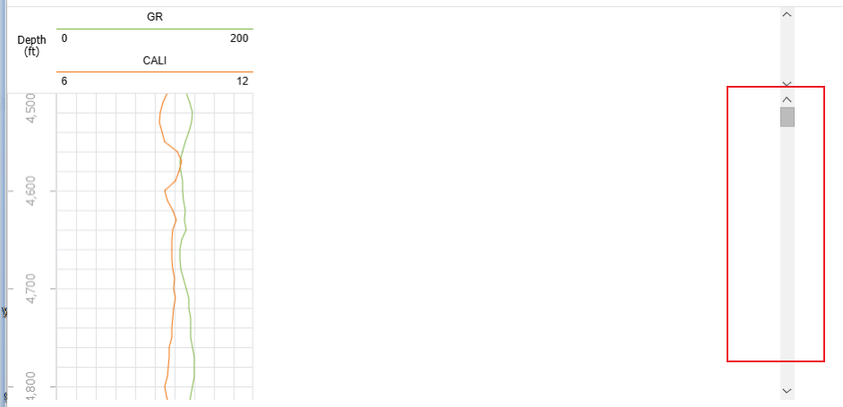

# int-scroll-bug-demo

### First

Put these three compressed files in the directory v3-webpack/src/libs  
int-geotoolkit-4.0.62.tgz  
int-geotoolkit3d-4.0.62.tgz  
int-impl-4.0.62.tgz

### Second

cd v3-webpack  
npm i  
npm run serve

### Third

cd root-v3-vite  
npm i  
npm run serve

then open the browser and go to http://localhost:3000/micro-children1/#/home  
In this case, the scrollbar can function normally

and visit http://localhost:5173/root/#/page-1  
In this case, the scrollbar has a bug  

The Scene Editing Tools example also has this bug. But i am not sure if it is caused by the same reason.
